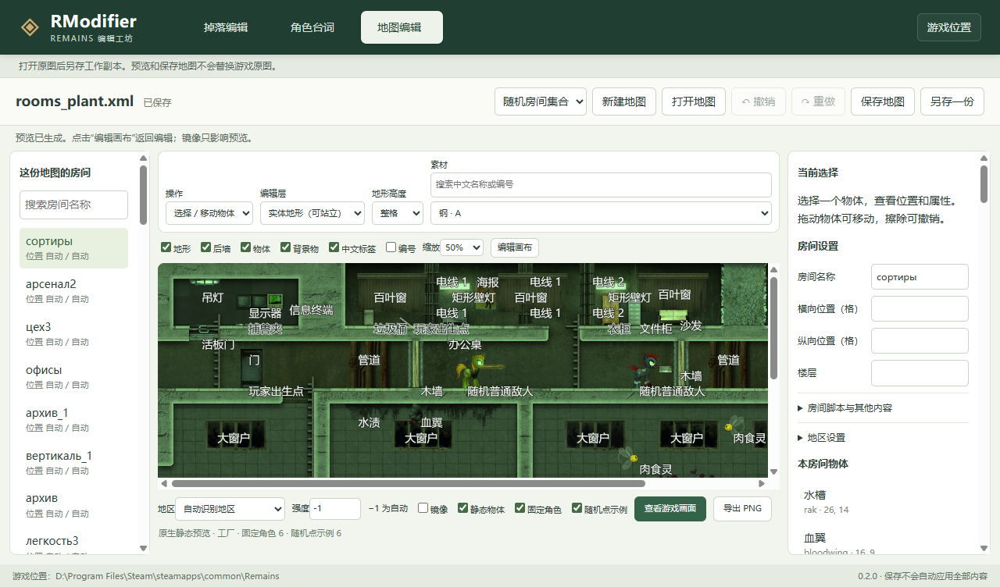

# RModifier 三编辑器整合返回报告

日期：2026-09-28。版本：0.2.0。状态：整合、正式目录迁移、单文件打包与隔离验证已完成；用户正式游戏的新版本重启核验按原选择保留待办。

## 交付结果

直接双击 `D:/Program Files/Steam/steamapps/common/Remains/mods/RModifier/RModifier.exe`。

这是一个可独立复制的 Windows 单文件入口，大小 131,390,882 字节（约 125.3 MiB）。启动时自动释放自带组件，用户无需安装 Node、输入命令或手工解压。实际测试把 EXE 单独复制到含中文和空格的目录，只保留这一个文件，成功启动三个编辑器并生成原生地图预览。

主窗口顶部可切换 **掉落编辑 / 角色台词 / 地图编辑**。三个页面各自保留修改、撤销记录和未保存标记；关闭窗口时可逐项保存或保留恢复草稿。某一页取消保存，窗口保持打开，另外两页的修改保留。再次启动程序会回到已有窗口，不重复打开多个编辑窗口。

单文件包含程序和绘图组件，仍需读取已安装游戏的素材。放在游戏外首次运行时选择游戏目录；草稿和配置写入游戏内的持久工程目录，不写入临时释放目录。

## 文件夹已正式改名

| 项目 | 当前状态 |
|---|---|
| 旧目录 | `mods/LootEditor` 已不存在，没有建立旧路径链接 |
| 新目录 | **`mods/RModifier`**，完整工程、历史备份和记录已整体迁入 |
| 用户入口 | `mods/RModifier/RModifier.exe` |
| 模块 | `mods/RModifier/release/LootEditorMod.swf`，版本 0.2.0 |
| ModLoader 唯一登记 | `RModifier\|LootEditorMod\|1\|0\|0` |
| 掉落配置 | `mods/RModifier/config/active.json` |
| 台词草稿/恢复 | `profiles/barks`、`config/barks` |
| 地图工作副本/恢复 | `profiles/maps`、`config/maps` |

内部入口类名和 SWF 文件名继续使用 `LootEditorMod`；`loot-editor` 游戏设置页、`LootEditor.log`、`LootEditor.receipt.json` 也保留，避免无必要地改变接口。新回执明确包含 `version=0.2.0` 与 `configRoot=mods/RModifier`。

迁移保留安装时间、原始游戏备份与恢复能力，仅更新安装记录中的工程路径和模块指纹。迁移时没有用户自建方案或 active.json，未替用户应用弹药示例。现有其他模组的全部登记保持不变。

共享资源表中的本项目目录登记已同步更新到游戏工作区和 `D:/RemainsMod` 的对应来源，避免后续同步恢复旧路径。

## 三个页面的功能

| 页面 | 已接入的主要能力 | 保存与生效 |
|---|---|---|
| 掉落 | 容器/敌人奖励、中文物品选择、机会/数量/耐久/候选权重、撤销、多方案、模拟预览、敌人额外对应弹药 | 保存保留草稿；应用后由游戏下次启动读取 |
| 角色台词 | 中文角色与场景、直接编辑句子、停用与备注、预览、v1 草稿导入导出、完整语言文件导出 | 可另存或备份后写入游戏；支持恢复上次写入；备注不进入游戏 |
| 地图 | 完整地图与房间、新建随机/固定地图、五层地形、四档高度、物体与背景编辑、中文标签、撤销、原生静态预览、PNG | 保存整份地图；正式原图要求另存工作副本，保存不会自动安装地图 |

地图画面在同一页内显示，隐藏 AIR 进程只负责绘图。素材、工程与组件路径分别指定，不依赖 portable 程序的临时释放位置。原生图覆盖固定角色和随机点示例，PNG 为 1920×1000，不带编辑标签。

台词和地图保存均检查来源变化，覆盖前备份，采用完整写入后替换的保存方式；损坏恢复文件不会静默丢弃。保存和预览结果绑定发起时的文档与修订，等待期间的新编辑不会被旧结果清除。更换游戏位置后，旧页面的延迟请求会被拒绝。

原 `tools/character-barks-editor` 与 `Editor` 工具保留作为历史来源，本次没有覆盖它们的用户作品或正式游戏文本/地图。

## 实际验证

| 验证 | 结果与范围 |
|---|---|
| UI 构建与 TypeScript | 通过 |
| 项目 Node 检查 | **46 项通过**：掉落规则/存储/安装器、25 项台词文件服务、5 项迁移/撤回检查 |
| 台词核心 | **44 项通过**；8 种可解析语言未编辑导出逐字节相同，原 Polish 源错误明确拒绝 |
| 台词实际页面 | **18 组通过**；原生文件服务、取消、导入导出、两次写回及恢复、重启留存、保存并发、快捷键与缩放 |
| 地图模型与服务 | **16 组通过**；31 份地图/662 房间读取无修改原文一致，包括未知节点、脚本、BOM、换行、目录链接保护 |
| 地图原生绘图 | **12 组通过**；55 工厂房间连续绘图、6 地区、镜像/强度、开关、取消恢复、旧结果拒绝、双实例及退出 |
| 地图实际页面 | **18 组通过**；编辑、整图保存、PNG、跨页保持、重启恢复和保存等待期间继续编辑 |
| 最终发行包宿主 | **8 组通过**；三页切换、分别标记、取消退出、逐页保存中取消、持久恢复与重启，无 JS/CSP 错误 |
| 最终发行包掉落页 | **14 组通过**；包括对应弹药、导入导出、回退、图标、快捷键与 125%/150%/200% 缩放 |
| 最终单文件 EXE | **6 组通过**；独立复制、中文空格路径、原生绘图、二次启动回到原窗口、持久留存及真实方案保存 |
| 新版掉落模块隔离游戏 | **128 个断言通过**；回执确认 0.2.0 与新配置目录，包含额外对应弹药、原规则保留、坏配置回退和原有模组组合 |

最终打包前后核对 **386 个运行输入**保持不变；打包目录里的实际绘图组件与双方冻结清单一致。地图交付的 32 项文件迁移前后均逐项核对。截图已查看。

验证使用独立测试目录、独立 AIR 应用 ID 和隔离游戏副本。没有操作真实存档，没有关闭用户正式游戏。对话框返回路径由测试自动指定；真实中文输入法组合过程和真人新手易用性仍未实测。

证据在 [evidence-rmodifier-2026-09-28](../knowledge/evidence-rmodifier-2026-09-28)。组件报告见 [台词接入记录](2026-09-28-barks-integration-api.md) 与 [地图交付记录](../map-editor/integration-report-2026-09-28.md)。

## 指纹与恢复

| 文件 | SHA-256 |
|---|---|
| 最终 `RModifier.exe` | `4fa9a002eadc23d0f8fb05a628b2aced0757ffa2252d9c4914730e01a2cd3533` |
| 0.2.0 `LootEditorMod.swf` | `fe1049393541f2ffc88cc88d4a61f4a83e550d8f30e91bc3c44fc8761cbc0a31` |
| `SceneHost.swf` | `a1c0a4ca1ea1e50ce54e7672378937e8e57554827649792af8401061d9eb93cb` |
| `NativeScene.swf` | `fcb620b9f4dc25eb3b4b54d420dfdf2549894472e8d0a331f06cdc321fc7cba7` |
| 正式根 `pfe.swf`，本次未改 | `c631cbf3511b6ee303f533d08d51511fe0eb702f43e5db17f5241d8576c64867` |
| 正式 `text_zh.xml`，本次未改 | `66da212793683b19e65e3973b726a94a2885d5032395af8a2e5a0fd20a17f895` |

两种恢复分开处理：

1. **撤回本次目录迁移**：`tools/migrate.cjs --rollback <migration.json>`，将目录、旧模块和登记撤回到 LootEditor，保留后续用户方案。记录位于游戏目录 `mods/.rmodifier-migration/1790576794146-3f61d4d1-3cbd-4ab6-ad98-cc8a4d33f6a8/migration.json`；后续主文件/登记已被修改时自动撤回会停止。此操作需先关闭编辑器，由维护者执行。
2. **恢复最初连接前的游戏**：在掉落页“我的方案 → 恢复连接前的游戏”。最初 `pfe_before_LootEditor_2026-09-28T00-13-05-389Z-2a4d4198.swf` 备份仍保留，指纹为 `b78244657ed407d03808c90e97325509db35f802122835f58933fff8003305ac`。安装器当前确认 connected/canRestore 均为 true；恢复需先保存并退出游戏。

本次迁移没有重新修改游戏主 SWF。运行中的游戏继续使用已读入的旧模块；下次由用户自行重启后，才读取新目录和版本。不能把隔离验证当成用户正式会话已加载。

## 交付边界与协作回执

掉落支持范围仍为 1.02 单人，没有认证 DLC 或联机掉落同步。地图原生预览属于静态画面，不运行 AI、剧情、玩家存档或实战随机生成；保存副本不表示地图已部署。旧台词工具的浏览器草稿需先导出，再在新页面打开。

地图方与台词方分别拥有自己的服务、页面和测试；本会话负责宿主、游戏连接、迁移、打包和最终验收。双方已授权直接协调并确认冻结。此前“准备报告”保留为历史规划，本报告记录实际完成结果。

发现并修正的构建/协作问题记录在 [构建与协调经验](../knowledge/rmodifier-build-and-coordination.md)。后续维护以新 `mods/RModifier` 路径为准，不恢复旧目录；原先通知里的独立地图窗口方案已由同窗口三页取代。

