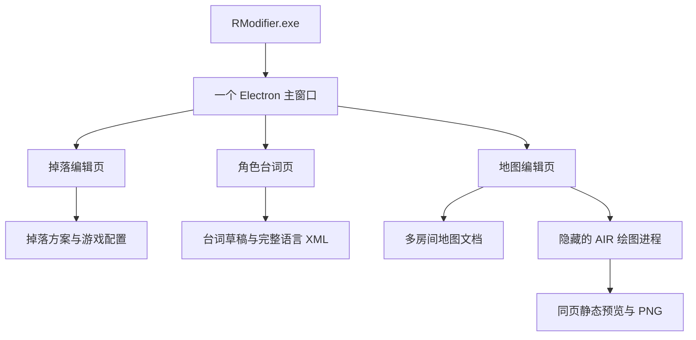

# RModifier 三编辑器整合准备返回报告

日期：2026-09-28。收件对象：角色台词工坊、地图编辑器维护方及用户。状态：准备完成，整合代码和迁移尚未实施。本报告由用户转交，未向其他会话发送消息。

## 1. 本轮结论与已确定的目标

采用当前 LootEditor 的 Electron 桌面工程作为宿主，最终交付一个 `RModifier.exe` 文件。双击后，在**同一个主窗口**内切换“掉落编辑 / 角色台词 / 地图编辑”三个页面，各页保留自己的内容、选择位置、撤销历史和未保存状态。

**用户已确定把工程文件夹从 `GAME/mods/LootEditor` 改为 `GAME/mods/RModifier`。** `GAME` 指本机 Remains 游戏根目录。新文件夹名是此次整合要求，不再列为待用户选择。建议程序名、窗口品牌和最终 EXE 同步使用 RModifier，副标题“Remains 编辑工坊”，三个功能页继续中文命名。

本轮按照“做准备并编写返回报告”完成核对与迁移设计，尚未移动文件夹、修改生产代码、生成新 EXE 或操作正在运行的游戏/地图编辑器。改名要与加载路径和安装记录一起迁移；提前单独重命名会使当前游戏模块找不到配置。

两份交接说明有三点被用户最新要求更新：

| 原交接建议 | 本次准备采用的目标 |
|---|---|
| 地图暂时继续使用独立窗口 | 地图最终也必须成为主窗口内的编辑页面；另开 AIR 窗口只能作为开发对照或恢复入口 |
| 产品名与 LootEditor 目录暂不改 | 实施时迁移到 `mods/RModifier`，明确处理旧数据和安装记录 |
| 复用现有目录式 Electron 包 | 改为单个便携 EXE 分发，运行组件自动展开，用户无需维护 Electron 配套文件 |

这不是增加两个启动按钮就能完成的工作。台词可以迁入现有网页界面；地图是 AIR 显示对象界面，需改造交互层，继续复用已验证的地图数据语义与原生绘图能力。

## 2. 当前版本与核对证据

本轮新做的是源码、指纹及只读数据核对；没有重新运行三套产品的完整测试。详细结果保存于 [准备基线清单](2026-09-28-integration-baselines.json)。

| 对象 | 实际状态 | 与来函的差异 |
|---|---|---|
| LootEditor | HEAD `3235b83f5df3ac6dfafcb60ad6023339e93dccf4`，0.1.0，工作树在准备前干净 | 与来函一致；Electron 44.4.5、TypeScript 7.0.2、esbuild 0.28.2 |
| 台词工坊 | HEAD `dea6a9ad289fa51e75217a830b504dbf17c42c0a`，工作树干净 | 比源码基线 `67cd0bc1…` 多一轮 README/design/state 文档提交，src/test 未变化 |
| 台词核心 | SHA-256 `3a46de6c…1ec6b17` | 与来函相同；本轮直接读取核心核对 17 类角色、102 组、976 句，无改动导出与当前简中文件逐字节相同 |
| 地图交接 | 首次核对 `handoff-manifest-20260928.json` 中 67 个文件全部匹配 | 收尾时两份源码出现后续变化，详见下段；原通知里的独立窗口方向已被本轮要求更新 |
| 正式根游戏 | `c631cbf3…6c64867` | 已安装掉落桥接；不能再当成桥接构建前输入 |
| 桥接原始备份 | `b7824465…03305ac` | 仍可作为明确指定的隔离构建输入 |
| 新目录 | `mods/RModifier` 尚不存在 | 当前未见目标目录冲突，真正迁移前仍需再检查 |
| 正式掉落读取 | 核对时没有 `LootEditor.receipt.json` | 维持“文件已安装、正式重启待核验”；用户此前选择自行重启，本轮不接管 |

地图三个配套文件的现有指纹为：`Editor.swf` = `e99e231f…4d99fd`，`EditorTools.swf` = `e2c6741d…7fae53`，`NativeScene.swf` = `fcb620b9…c7cba7`。完整 SHA-256 见基线清单。

**10:07 北京时间收尾复核出现新差异：** NativeRenderer.as 已由 `11764e57…cea0b6` 变为 `ec197e2e…7d5d63`，PreviewPanel.as 已由 `45e7f98a…349a93` 变为 `8c0aa548…e37eb`；另检索到交接表未包含的 NativeEntities.as（`34288033…31f969`）。源码增加固定实体/随机点示例绘制，以及 entities/examples 两个预览参数；该时点三个已部署组件与根 pfe 仍为上述旧指纹。本轮未修改这些文件，也没有验证新增行为。基线清单同时保留首次快照与 closeoutRecheck，后续迁入前应接收地图端更新后的完整清单、配套产物和验证证据，不能用旧 63 例结论认证这批新源码。

既有验证记录可作为回归样本：掉落 16 项 Node、14 组桌面流程、128 项 AIR 断言；台词 44 项核心、38 项浏览器流程；地图 63 例预览、113 个密集标签、55 间房保存对照与实际 GUI PNG 导出。**这些数量不是本轮或未来整合版本的通过数。** 台词原测试脚本会写自己的 validation 目录，本轮没有在对方工程运行它。

经验检索为 partial，存在不可读来源；另已回读 KB-000068 第 1 修订，采用“进程存在不等于窗口/保存成功”的核验原则。缺失来源不被解释为没有相关经验；具体设计以本机源码为依据。

## 3. 同窗口三页的实现建议

建议保留 Electron，拆出三个固定功能模块，不建设通用插件平台。



掉落页保留容器、敌人、对应弹药和方案四个内部分类。台词页复用已有中文编辑体验。地图页在 Electron 中提供房间列表、地形/物体画布、属性表、中文标签和预览面板；实际游戏画面预览继续由 `NativeRenderer` / `NativeScene` 绘制，再把 PNG 与诊断结果交给地图页。

推荐先验证“网页地图交互 + 隐藏 AIR 绘图进程”路线。现有 `PreviewHarness.as` 已有隐藏原生窗口、保留舞台并输出 PNG 的实现和历史证据，所以具备复用依据；但它是一次性测试程序，**还没有持续会话、请求取消、跨进程协议或新资源路径**。这些都需新增，不能把测试壳直接当生产服务。

当前 CSP 为 `object-src 'none'`，`ToolsContext` 返回的是 AIR 内部显示对象，不能作为网页数据直接嵌入。把整份 Editor.swf 放入 iframe、拼接两个 app.js、修改窗口父子关系来包住旧 AIR 窗口，均不作为主路线；后者的中文输入、缩放、模态框与焦点行为没有本机验证。

隐藏绘图进程需要有舞台。AIR 的 `-cmd` 模式不创建初始窗口和 Stage，不能代替当前绘图宿主；命令行参数可通过描述符、应用根与 `--` 显式传入，已有实例会接收 invoke，退出码 1 也可能是正常转交。[AIR 官方 ADL 文档](https://airsdk.dev/docs/building/air-debug-launcher)

先做一个隔离技术样例，验收：打开多房间副本、改一个物体、切换三页仍保留未保存内容、隐藏绘图进程返回预览、导出 PNG、保存后重开地图数据一致。通过后再扩大地图交互覆盖。若绘图进程不能满足会话与资源隔离要求，重新评估该内部实现，不降低“同一窗口三页”的交付标准。

## 4. 建议目录与迁移清单

以下为**拟议结构**，本轮没有创建这些生产目录。掉落 profiles 顶层结构保持兼容，避免同时重构既有方案格式。

```text
GAME/mods/RModifier/
  desktop/
    main.cjs / preload.cjs
    platform/                 根目录解析、具名文件操作、迁移与关闭协调
    ui/shell/                 三页导航、状态与当前页操作栏
    ui/loot/                  现有掉落页面拆入
    ui/barks/                 台词页面迁入
    ui/map/                   地图交互界面
    barks/                    台词核心、词典、草稿和语言文件处理
    map/                      完整地图文档、选择与编辑规则、绘图请求
  src/LootEditorMod.as         保留游戏入口类名；更新配置目录
  src/loot/RuleEngine.as       掉落规则语义保持
  map-editor/
    native/                   NativeRenderer/PngWriter/新增绘图宿主
    legacy/                   旧 Editor/EditorTools 增强源码及重建说明
    localization/             编辑器词典、字体与显示补丁材料
    tools/                    预览库构建与保全检查
    vendor/                   固定基线清单与取回/核验说明
    fixtures/                 有来源的少量地图副本
  profiles/*.json              既有掉落方案
  profiles/barks/*.barks.json   v1 台词草稿
  projects/maps/<项目编号>/    地图 XML 工作副本、项目说明
  config/active.json           已应用的掉落配置，含义不变
  config/installation.json     掉落安装/恢复记录的兼容迁移版
  config/barks/               台词索引、留存、写回记录
  config/maps/                地图索引、最近文档与视图偏好
  backups/                    分类备份和目录迁移记录
  release/LootEditorMod.swf    游戏模块，类名与文件名继续匹配
  build/out/                  可再生中间物与隔离验证
  dist/RModifier.exe          用户只需双击的单文件产物
```

| 来源或宿主文件 | 准备后的改动位置与用途 |
|---|---|
| 台词 `src/core.js`、`catalog.js` | 迁入 `desktop/barks`，保留文本局部替换、v1 草稿、历史、选句语义；处理 UMD/ESM 和类型接口 |
| 台词 `app.js/index.html/style.css` | 拆成有挂载/销毁入口的台词页，移除全局事件和浏览器下载/存储依赖；CSS 限定页面根节点 |
| 台词 `test/`、validation 中的样本 | 迁移核心断言和浏览器业务流程，再加原生对话框与真实落盘检查；历史结果只归档 |
| `desktop/main.cjs` | 当前单一 dirty 改为文档状态汇总；新增明确根目录解析、单实例入口、三类文件操作与关闭协调 |
| `desktop/preload.cjs` | 保留具名白名单，加入台词/地图操作；不暴露任意路径读写或命令执行 |
| `desktop/ui/app.ts/index.html/style.css` | 抽离宿主导航和掉落页，避免两套全局事件、Ctrl+S/Ctrl+Z 串页 |
| `desktop/store.cjs/install.cjs` | 参数化模块根；兼容旧安装记录、恢复前缀、登记行和迁移中断状态 |
| `src/LootEditorMod.as` | 将 active.json 来源改为 RModifier；更新模块版本/读取记录所需信息 |
| `package.json`、`tools/package.mjs` | 包名/品牌、单文件构建；分离桌面包与已验证桥接载荷 |
| `build/*.ps1`、`tools/prepare-test.ps1`、`tests/*` | 去除旧固定目录，增加迁移和新路径回归；测试变量改名需兼容旧变量一段时间 |
| 地图 `Enhancements/src/` | 迁入原生绘图/旧编辑器参考；复用标签算法语义，新增生产绘图协议；PreviewPanel 的用户操作迁到网页页内 |
| `prepare_native.py`、`preserve_native_assets.py`、`verify.py`、`build-config.xml` | 改为显式基线、游戏素材根、组件根和工具路径；保留字节码与非代码标签保全 |
| `Localization/display-patch/` 与 `Source/localization-code` | 保留字体/中文修复与旧宿主重建能力；不能用社区原版替代当前增强版 |
| 地图旧 VBS/BAT/描述符 | 最后切换为同一 RModifier 的地图入口；旧组件作为恢复包保留，停止双份独立维护 |

不整包搬运 `Editor/Work`、大型反编译/readback/native-* 生成物或所有历史备份。用户作品先列清单、复制核对，构建基线单独归档；旧台词工坊在迁入验收前保持可用。

## 5. 页面与文件操作接口草案

下面的接口是待实现约定，不是现有可调用能力。

| 模块 | Interface（调用方须遵守的操作与语义） |
|---|---|
| 页面模块 | `mount(root, host)`、`activate()`、`deactivate()`、`getState()`、`saveDraft()`、`dispose()`；隐藏不销毁文档，只有当前页接收快捷键 |
| 文档状态 | `workspaceId/documentId/revision/savedRevision/dirty/saving/error`；另存导出、应用和读取状态单列；保存响应只确认其对应 revision |
| 掉落文件 | 沿用保存、导入导出、应用、连接检查与恢复；不把地图/台词文件交给掉落 Profile 校验器 |
| 台词文件 | 选择语言文件、导入/保存 `.barks.json`、导出完整 XML；后续 `applyLanguage(expectedHash)` / `restoreLanguage(operationId)` |
| 地图文件 | 打开完整多房间 XML、保存/另存、恢复工作草稿、生成房间快照、导出 PNG；不以当前房间快照代替整个地图保存 |
| 绘图进程 | `inspect/start/render/cancel/dispose`；事件 `starting/ready/rendered/error/closed`，返回组件版本、输入版本和输出指纹 |
| 只读规则定位 | `locateLootRule({kind, modelId, documentRevision, objectRef})`；返回型号规则、共享表及影响范围，不保存或应用任何方案 |

渲染页面只传文档编号或由文件选择器生成的文件句柄编号。主进程维护目标路径与允许操作，不相信草稿内给出的任意路径。主进程和页面两端都校验格式、大小和修订号；保留 `contextIsolation`、`sandbox`、CSP、来源验证和外部导航限制。该安排符合 [Electron 官方安全说明](https://www.electronjs.org/docs/latest/tutorial/security)。

关闭与切换按以下语义实现：

- 普通切页不要求保存，不清空另一页的 dirty；页面与撤销历史一直保留。
- Ctrl+S 只保存当前页文档。保存掉落不能把台词或地图标为已保存；保存期间继续编辑，用内容修订号避免旧响应清掉新改动。
- 关闭程序或切换游戏根时，汇总三页的未保存文档，提供逐项保存/保留恢复草稿/继续编辑；保存失败保留窗口和错误。切游戏根必须等三页处理完成后一起切换。
- 自动留存不等于已应用。标签写清“保存掉落方案”“保存台词草稿”“保存地图”，没有含糊的“应用全部”。
- 中文输入法正在组词时不截获字符或提交半句；撤销边界包含备注、停用与标记，视图选择变化不把文档变脏。

地图进程采用每个宿主会话一个私有目录，先以原子请求/回执文件通信。消息至少包含协议版本、sessionId、requestId、文档版本、输入哈希、操作与参数；回执关联请求，过期结果不更新当前画布。主进程核查文件仍在该会话目录内、限制消息大小，PNG 输出只允许写会话根。采用新的 RModifier 绘图应用 ID 与 `gameRoot` 绑定，避免转发给用户当前旧地图窗口。复用同一 session 的实例，宿主关闭时只清理自己创建的绘图进程，不操作用户现有 AIR 实例。若临时解压目录会清理，先等待绘图进程退出再结束便携启动器。

## 6. 台词接入的具体处理

接受来函建议：先完成同页编辑、旧草稿兼容和原生保存/导出，再独立验收直接应用与恢复。

v1 `.barks.json` 保留 `format: remains-barks-project`、version、source.raw/sha256、entries、停用、备注、标题和选择位置。新增桌面 UUID/索引放旁边，不改变旧格式含义。浏览器草稿由旧工坊导出后导入；不承诺自动读取浏览器私有存储。台词放 `profiles/barks`，不进入掉落 profiles 顶层扫描。

主进程按 UTF-8 字节严格读取并保留 BOM/换行；核心的自有 XML 检查必须在 Node 中执行，不能依赖仅浏览器存在的 DOMParser。无编辑导出逐字节一致；编辑保留非台词区域、未知属性与注释。不同语言或新版文本不按 origin 行号强行对齐。粗口 `m` 属性只要存在就生效；过滤、玩家重抽一次、名字和性别替换继续沿用当前已证实规则。

应用语言文件要保存“最初草稿来源指纹”与“最近确认的磁盘目标指纹”两套状态。目标外部变化时停止覆盖；成功后更新目标基线，连续第二次应用应正常。先备份并核对，再临时写入/校验/替换，记录失败和恢复位置。另存为若选到正式游戏语言文件，必须转入此流程，不能绕开备份。恢复只处理该语言文件，不修改掉落安装或地图作品。

台词状态最多显示“已写入游戏文件，重启后使用”；`LootEditor.receipt.json` 不证明语言已读取。ModLoader 暂停掉落也不会恢复语言文件。首版仍不扩展剧情对话、触发概率、冷却、新事件或每个具体 NPC 的独立词库。

## 7. 地图接入的缺口与返回要求

同窗口要求增加了地图网页交互层的工作量。继续使用当前增强版的模型、中文词典和预览库，保留原编辑器作为行为对照，不重新下载覆盖它。

需要保留的操作至少包括：多房间打开/保存与房间列表、地形及前后层、对象/背景的选择放置和擦除、属性/options/脚本保留、层与 ID 显隐、透明标签/自适应字色/避让/引线、地区/镜像/物体开关、缩放拖动和 PNG 导出。普通属性逐步提供中文表单；既有复杂脚本完整保留，不能以简化界面为由丢弃。

本轮额外查到：`Editor.as:785` 的 `encodeAll()` 新建 `<all>` 并只追加 land 与房间，`encode():819` 重新构造已知房间字段。这是静态代码事实；现有 55 间房对照不足以证明任意未知顶层节点/属性都能保留。新地图文档模块应保留原 XML 中不理解的区域，无改动优先返回原字节；编辑采用局部更新或显式保留未知节点的结构，不盲用通用序列化覆盖全文。保存验收同时检查语义与未编辑区域，允许已确认的同级对象排序变化，不放宽地形行/脚本顺序与重复对象计数。

路径必须显式拆为：

| 根目录 | 用途 |
|---|---|
| gameRoot | 选中的游戏素材、词典与 Rooms，只读取材 |
| componentRoot | 本次便携程序解压后的组件/SWF/描述符，使用 process.resourcesPath 等实际资源定位 |
| dataRoot/workRoot | `GAME/mods/RModifier` 的持久配置与用户地图工作副本，不能落到临时解压目录 |
| sessionRoot/logRoot | 当前宿主会话、预览 PNG、日志，可在测试环境完全替换 |

`NativeRenderer` 中 NativeScene 属 componentRoot，四份素材/中文词典/Rooms 属 gameRoot；`EditorTools.log` 与绘图输出属 logRoot；只设置子进程 cwd 不足以完成迁移。EditorConf 旧偏好需通过受控的一次性导出/导入迁移语言和最近文件，路径不存在就说明并让用户重选。未保存地图先在旧编辑器保存工作副本；不尝试从另一个运行进程抽走画布。原文件不被剪切或自动覆盖。

请地图端补齐或协助确认的材料（可由后续本地调查补齐，不要求用户手工找代码）：

1. 现有交接未列全基础地图模型源码，针对固定 Editor.swf 导出 `edTile` 等编解码依赖与素材目录结构；当前指定源码目录未检索到独立 `edTile.as`。
2. 按上述原操作整理行为对照，明确随机房/固定地图、doors/层坐标/对象属性的编码规则；提供未知节点和重复对象的额外样本。
3. 将 NativeRenderer 的资源根改为显式参数，并提供常驻绘图宿主的 ready/render/error/退出约定；当前 ToolsContext/ToolsSnapshot 不满足此用途。
4. 接受网页侧标签实现的算法/词典迁移及原生预览对照安排；63 例、113 标签、55 房样本均保留来源。
5. 为本轮期间新增的 NativeEntities、entities/examples 参数提供配套版本与新验证结果；绘图协议的能力列表需能区分旧交接版与新增实体版，整合时保留已验新能力，不覆盖正在进行的源码更新。

原生库重建以交接版 5,683 方法仅原定 6 项变动、5,039 个标签的非代码字节保全为对照；新增实体版本如需要调整原生方法，须重新说明差异并建立证明，不能套用旧数字。保留 `preserve_native_assets.py` 和兼容旧宿主的 `PngWriter`。绘图进程不运行游戏主循环、模组 loader、存档、敌人 AI/剧情/战斗；静态角色和随机点示例不能被宣称为实际刷怪或完整模拟。

## 8. 单文件 EXE 与构建基线

建议使用 electron-builder 的 Windows `portable` 目标，产物名 `RModifier.exe`。单文件指用户获得并双击一个 EXE；Electron/AIR 辅助组件运行时会自动展开，用户项目与配置仍是持久文件，不写进 EXE。官方 portable 选项提供临时展开目录配置，不能继续假定 app.getAppPath 向上四层就是模组目录。[electron-builder PortableOptions](https://www.electron.build/docs/api/app-builder-lib.interface.portableoptions/)

首版继续读取本机已有 Remains 素材和 AIR runtime；用户不需另装 Node/Electron，也不将完整游戏资源重复打入工具。程序离开游戏目录启动时使用已选择游戏记录或中文目录选择，开发目录绝对路径不进入产物。全局偏好/窗口状态放独立 RModifier 用户数据目录，游戏绑定配置留在 dataRoot；选择只读游戏根时，允许查看/另存，但不假装应用成功。

需新增固定版本的打包工具与锁文件，验证真正的单文件离线启动；本轮没有安装该工具或产出单文件包。现有目录式程序约 383 MiB，压缩后大小和首次启动耗时需实测，不提前保证。

构建拆成三条独立流程：

| 流程 | 输入与证明 | 输出/用途 |
|---|---|---|
| 掉落桥接构建 | 明确指定的 `b782…` 隔离基线、补丁源码、4,602 个无关方法保全证明 | `c631…` bridge 与带输入/输出/工具版本/验证证据的载荷清单 |
| 地图绘图库构建 | 固定 `c631…` 基线、NativeScene 修改和标签保全证明 | 独立 NativeScene，不能装成游戏 pfe 或登记为 ModLoader 模组 |
| 桌面构建/便携打包 | 固定已验证载荷、三页资源、地图辅助组件各自指纹 | RModifier.exe；不要求正在使用的游戏回到安装前状态 |

当前 `tools/package.mjs:6` 直接检查 live pfe 必须为 `b782…`，确实会挡住已安装本机。应让它消费已验证载荷清单，校验载荷自身和证明对应关系；不是删除检查，也不是把 `c631…` 填成“原始基线”。改名需要新的游戏模块 SWF，但若桥接接口不变，根游戏桥接可以继续使用已验证 `c631…`，无须再次修改 MainFE 或根 pfe。

桌面版本、游戏模块版本、桥接版本与地图绘图组件版本分开记录，更新台词页不强迫重建所有 SWF。测试与开发缓存、用户草稿、备份、工具链不放进分发载荷。绘图 SWF/描述符需要真实文件路径，不能只留在 ASAR 包内部。

## 9. LootEditor → RModifier 的正式迁移安排

改名同时涉及工程和游戏数据目录，不能做字符串全局替换。

| 项目 | 迁移后的约定 |
|---|---|
| 文件夹/品牌/最终入口 | `mods/RModifier` / RModifier / `RModifier.exe` |
| AS3 入口类与 SWF 文件 | 保留 `LootEditorMod` 与 `LootEditorMod.swf`；它们代表掉落子功能，减少不必要的兼容变动 |
| ModLoader 行 | 从 `LootEditor|LootEditorMod|1|0|0` 改为 `RModifier|LootEditorMod|1|0|0`，调用原扫描器；旧行移除，不能两份模块同时加载 |
| 掉落配置 | `mods/RModifier/config/active.json`；schemaVersion 1 与内容指纹算法保持 |
| 日志/回执/桥接字段 | 首轮保留 LootEditor.log、LootEditor.receipt.json、lootEditorBridge 等内部标识；新桌面按模块版本和路径核对，不能被旧回执误认成功 |
| 旧根 SWF 备份 | 保留原文件名 `pfe_before_LootEditor_2026-09-28T00-13-05-389Z-2a4d4198.swf` 及其原始指纹，不改写历史 |

实际实施顺序：

1. 在隔离副本完成新模块编译、三类数据与打包根路径的迁移验证。核对正式游戏/配置/登记表当前状态；存在 RModifier 目标时停止合并，避免覆盖。
2. 为迁移建立独立清单和唯一备份，列出源目录、目标目录、配置/方案/备份的指纹与原安装记录；路径解析必须限制在已选 GAME 内。不为了改名关闭用户正在运行的游戏或地图编辑器，待无占用时再切换正式目录。
3. 移动自有工程及其 .git、profiles、config、backups，部署读取 RModifier 路径的新游戏模块；更新显式根目录解析与入口。较大的可再生 build/cache 只按清单处理，不能借机删除作品。
4. 兼容迁移 installation.json：保留原始 sourceHash、installedHash、根备份路径和 previousRegistry 的原意；将本模组 backupDir 映射到新目录、runtimeHash 更新为已验证新模块。恢复代码同时识别旧版记录与旧备份前缀，不能仅重写一个字符串便声称可恢复。
5. 保留各家登记行，只替换本模块行并运行原扫描器，确认恰好一条启用登记。旧运行 SWF 放到扫描范围外的备份位置；不建立会被扫描成第二个模组的旧目录联接。
6. 核验所有文件与登记，再记录迁移成功。中断时按迁移清单恢复到“旧目录 + 已安装掉落桥接”的状态；这是**撤回改名**。现有“恢复连接前的游戏”仍恢复到最初 `b782…`，两种恢复不可混用。
7. 新启动后核验模块版本、正确目录、配置指纹与回执。已有 receipt 即使 profileHash 相同，也必须满足新模块/迁移时间，不能只看旧 ready 状态。

源码引用、测试环境变量、构建脚本、文档链接与自有 AGENT_SCOPE 参数须随实施保持一致；用户给出的原交接文档及历史证据不回写成仿佛原先就叫 RModifier。旧 VBS/BAT 最后指向统一入口；跨工具组件在对应整合阶段迁入，恢复包保留。

## 10. 分阶段工作量与依赖

以下是按已读代码给出的相对工作量，不是日历工期承诺。最大的增量来自地图同窗口化；先通过技术样例后才能可靠细化。

| 阶段 | 工作量 | 交付与依赖 |
|---|---|---|
| P0 本轮准备 | 已完成 | 两份交接核对、67 项初始指纹及收尾源码差异、台词只读往返、接口/目录/改名/打包与验收报告 |
| P1a 宿主基础与技术样例 | 中 | 三页导航/状态、显式根目录、打包拆分；地图页隐藏绘图往返样例。原“仅启动独立地图窗口”里程碑不作为新目标的完成标准 |
| P1b 工程与名称迁移 | 中 | RModifier 工程、固定载荷、旧安装与方案兼容、扫描器登记/回退；正式切换前先完成副本检查并避免现有进程占用 |
| P1c 台词页完整接入 | 中 | 迁入核心/界面，v1 草稿、原生保存/导出、三页未保存与快捷键；依赖 P1a 的接口 |
| P1d 地图页完整接入 | 最大 | 地图模型/交互/中文标签/属性、持久项目、原生预览及 PNG；依赖基础模型补齐与技术样例通过 |
| P2 可选联动与台词写回 | 小至中（定位）；中（写回） | 按确定型号只读定位；语言文件备份/冲突/恢复各自验收，不扩大成地图安装或单实例掉落 |
| P3 单文件交付回归 | 中 | 真实 portable EXE、离线/路径/重开/三页实际操作和恢复验证、说明更新；三页功能齐备才宣称整合完成 |

原来函 P1a/P1b 的工程、资源路径和生命周期工作仍要做；原 P2 的型号定位保留为后续独立功能。原通知将同窗口列到 P3，本轮已提升为最终基础验收要求。

## 11. 整合验收与测试隔离

1. **主窗口**：连续在三页之间切换，分别修改文档、撤销、保存及失败重试；任何一页不清除另一页内容。关闭/换游戏根时保住全部未保存内容；中文输入与缩放实测。
2. **掉落**：旧 profiles/config 可读写，示例额外弹药规则不变；安装、应用、暂停和恢复语义保持。改名后在隔离 AIR 中验证实际新模块路径和恰好一次加载，不能只验证 TypeScript。
3. **台词**：迁移 44/38 项业务断言，新增实际文件选择/取消/落盘；八种有效语言无改动字节一致，错误波兰文明确拒绝；旧草稿中的停用和备注保留。保存/导出与正式写回分开证明。
4. **地图**：多房间完整往返、未知节点/属性、脚本与地形顺序、重复对象、随机/固定地图；复用 55 房数据对照和 63 例静态预览、113 标签样本；在新主窗口实际操作导出 PNG，再独立解析尺寸/CRC/像素数据。
5. **绘图会话**：缺资源、启动失败、版本不匹配、重复启动、旧请求晚到、取消、超时和异常退出；不误接旧 remains.mapeditor，不强杀其他 adl 实例。
6. **单文件**：从游戏目录外、中文/空格路径、不同 cwd 和离线环境启动；多次双击唤起同一主窗口；无需 Node 或源码目录；关闭后再开，用户作品不随临时组件清理而消失。
7. **迁移/回退**：旧目录有数据、新目录冲突、扫描失败、模块替换失败、中途退出、只读路径；原备份仍有效，旧方案与新作品均保留，测试撤回改名与卸载桥接两条不同路径。

沿用旧 `LOOT_EDITOR_TEST_ROOT` 的兼容入口，但测试模式必须同时显式指定假 gameRoot、dataRoot、workRoot、sessionRoot。任何新增 XML 写回/地图保存/运行时部署都断言最终解析路径在隔离根下，并在结束核对真实文本、正式 Rooms、游戏 SWF 与存档未变。不能因为旧安装器禁用，就假定新文件操作自动安全。

本次准备没有运行这些集成验收，没有安装新依赖，也没有移动用户作品。没有新增定时检查或后台监控。

## 12. 两方返回要点与待决事项

**给台词工具维护方：** 接受核心、中文词典、v1 草稿与无损写出的复用方式；修改维护目标为 `mods/RModifier`，宿主状态要覆盖三个编辑器。请保留当前可运行基线和旧草稿样本；暂无阻塞准备的额外用户决定，迁入后统一维护，原 HTML 作为恢复版本保留。

**给地图工具维护方：** 交接 67 项初次全部匹配，收尾发现 NativeRenderer/PreviewPanel 和新增 NativeEntities 的源码更新，请一并补发冻结清单、配套构建与验证。用户目标已变为同窗口三页，请按第 7 节补齐基础模型/行为覆盖和常驻隐藏绘图接口。独立窗口启动器可以保留为对照，但不作为最终整合验收。当前中文增强、NativeScene 和保全工具继续沿用。

**已确定、无需重问：** 整合三个编辑器、零代码中文体验、同窗口切换、单 EXE 入口与 `RModifier` 文件夹名。建议的内部实现、阶段划分和便携展开方式尚需技术样例验证，不等于已有功能。按当前目标可以继续做技术准备，没有必须先让用户重新拍板的业务分支；正式代码整合属于后续实施阶段。

只读型号定位的边界也明确：`container:model:case` 是“盒子”，`container:table:case` 是“手提箱”；chest 型号“大箱子”与共享表“宝箱”分别显示。确定敌人型号才可定位；随机生成标记显示无法确定。关联操作不改 XML ID/code/uid，不承诺只影响所点的一只箱子，不自动应用掉落方案。

输入材料：[台词通知](../../../tools/character-barks-editor/design/2026-09-28-looteditor-developer-notice.md)、[台词完整规划](../../../tools/character-barks-editor/design/2026-09-28-looteditor-integration-plan.md)、[地图通知](../../../Editor/Integration/loot-editor-developer-notice-20260928.md)、[地图完整规划](../../../Editor/Integration/loot-editor-integration-plan-20260928.md)、[地图原交接指纹](../../../Editor/Integration/handoff-manifest-20260928.json)。
