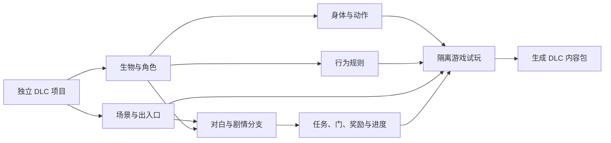

# Remains 独立 DLC 编辑器：调查与实施方向

日期：2026-09-30。状态：**调查与概念设计，尚未开发 DLC 运行模块或正式编辑器**。

本轮问题：让没有 Flash、AS3 或编程基础的作者，用图形工具制作新场景、全新身体/动画/AI 的生物，以及有选择和后果的剧情。

用户已确定：① 从一开始支持全新身体结构、动画和 AI，不能把首版目标降为原敌人换皮；② **新编辑器与 RModifier 已有地图编辑窗口分开**；③ 首个新生物尚未设想，本文中的“六足测试生物、试验站、观察/清理两条路线”仅为技术验证占位，不是用户的 DLC 设定。

本轮交付：[独立窗口交互概念](2026-09-30-dlc-editor-concept.html)、本文、[剧情与存档源码审计](../knowledge/2026-09-30-dlc-story-source-audit.md)。概念稿可操作足数、动作相位、行为条件、分支选择和引用检查，但**不连接游戏、不保存项目、不构建 DLC**。

## 1. 建议做什么

建议开发一个**可单独启动的 Remains DLC 工坊**，并为游戏补一个通用内容运行模块。创作者只操作图片、画布、时间轴、中文条件和连线；运行模块负责把这些内容变成游戏里的对象和事件。

两部分缺一不可。只做界面，会出现“图画出来了，新敌人却不能被子弹命中”“连好了对白，读档却忘记选择”；只补运行模块，作者仍然要手写复杂配置。

已有 RModifier 提供了值得复用的地图原生绘图、完整文档保存、掉落规则、随机台词、安装备份和隔离测试基础。新的 DLC 工坊应复用这些底层能力，同时拥有自己的启动入口、主窗口、项目和草稿。**不把 DLC 的全部工具塞进原地图窗口，也不让打开 DLC 切走原窗口正在编辑的地图。**

默认研究基线为本机实际游玩的 **Remains 1.02、Windows、单人**。用户制作的“DLC 内容包”与安装目录中名为 `DLC/` 的 1.03/1.04 游戏版本是两回事；本轮没有验证后两者。

## 2. 已有能力与实际缺口

证据等级：**源码确认**是本次读取原始反编译文本得出的结论；**既有实测**是明确引用之前的结果，没有本轮重跑；**建议/待验证**是可行路径，不能称已经实现。

| 你希望做的事 | 可复用的基础 | 还需要补什么 |
|---|---|---|
| 画一间新房、放置原有对象 | 原 Flash 地图 UI、原生预渲染、完整 XML 文档和副本保存 | DLC 项目自己的场景会话与引用目录 |
| 做一个新的可往返地区 | 房间文件、地区定义、转移和解锁方法 | 地区注册、加载时机、入口/出口、目的地界面与存档 |
| 让新场景有全新视觉主题 | 原有素材分层、材质和背景机制 | PNG 背景/装饰/地形导入、材质登记，以及碰撞与破坏属性 |
| 做全新身体、动作的敌人或生物 | 原版已有图片逐帧动画、公共 Unit 基类 | 图片/部件导入、关节和挂点、动作时间轴、通用生物类型与创建入口 |
| 设计全新的 AI | 现成的物理、感知、武器、伤害、死亡入口 | 自己的行为执行器、条件/行动卡片、移动规则及可解释的运行追踪 |
| 写会改变后续的对话 | 顺序对白、条件、任务、标记与对象事件 | 玩家回复选项、可组合条件、分支执行、一次性后果和恢复策略 |
| 保存、继续玩、分享 DLC | 原生任务/地区/对象存档；RModifier 备份与安装事务 | DLC 版本/依赖、内容身份、扩展存档、迁移、缺包提示和可回退安装 |

现状核对：调查开始时正式 `RModifier.exe` 仍为 0.3.2；调查期间另一已授权会话完成 0.4.0 交付，统一提交 `d528762`，正式入口 SHA-256 为 `186deab0edef93d6b9abc2db70eeac6dbcb7a59e571aeb94f3e9aa1d21e5b7af`，回执见 `knowledge/evidence-rmodifier-0.4.0-2026-09-30/editor-update.json`。不能只把工作树版本号当成交付证明。0.4.0 场景库已有 **31 个来源文件、662 间房间**；随机混抽覆盖 8 组文件对应 10 个地区身份。其“71 项实际游戏检查”是既有地图工作报告的证据，证明的是混抽与保存/读取，不是新剧情地区或自定义生物。见 [场景库交付记录](2026-09-28-scene-library-and-room-pools.md)。

## 3. 作者实际怎样使用

建议按“项目里正在制作什么”组织界面，常用步骤如下：

1. **新建 DLC 项目。** 填名称、简介，选择测试入口。软件处理内部编号和文件组织。
2. **制作场景。** 在 DLC 自己的场景编辑区画房间，连接出入口，导入背景和装饰；随时看原生静态预览。
3. **制作生物。** 导入整套逐帧图片，或导入身体/腿/尾巴等部件，在画面上连接关节、画受击区与移动碰撞范围。
4. **制作动作与行为。** 摆关键姿势，标记攻击生效时刻；用“看见玩家 → 接近”“生命低于 30% → 逃离”这样的卡片组合行为。
5. **制作故事。** 将人物对白、回复选项、任务目标、门和奖励连接起来，选择后能看到哪些场景状态改变。
6. **检查、试玩、导出。** 点击错误直接定位缺失房间或素材；用独立测试存档跑两条路线；通过后生成自己的内容包。

“集约化”在这里指共享项目和引用关系：从场景中的一只生物可以跳到它的动作、AI、掉落和相关剧情；改显示名称不会断开这些联系。它不要求所有工具挤在一块画布上。

## 4. 独立窗口的具体边界

| 项目 | RModifier 原地图窗口 | 新 DLC 工坊 |
|---|---|---|
| 用途 | 原有地图查看、修改、房间池工作 | 新内容包的完整创作 |
| 启动 | 原 RModifier 入口 | 可单独启动的新入口；名称待定 |
| 编辑文档 | 原窗口当前打开的文档 | DLC 项目自己的场景副本 |
| 草稿、恢复、偏好 | 沿用原数据 | 独立数据根与项目目录 |
| 预览 | 原有原生预览会话 | 自己的预览会话，可复用同版本绘图组件 |
| 生物/剧情工具 | 保持原用途 | 新增独立工作区 |
| 向游戏提供内容 | 原有功能的应用流程 | 检查后生成版本化内容包 |

研发建议：现有地图组件有 `NativeMapModule`、独立 AIR 会话、文档身份和完整 XML 保存层，可抽出可复用接口；DLC 窗口使用新的会话与数据根。**复用组件不等于复用正在打开的进程、SharedObject、草稿文件或全局配置。** 两个窗口同时编辑同一路径时，应检测磁盘变化并提示比较或另存，不能后保存者静默覆盖。

代码暂可在现有仓库中建立独立应用子目录、明确共享组件边界，也可以以后拆仓库；这不影响“窗口和使用方式独立”的决定。本轮没有建立新模组目录、移动现有源码或改变保护文件。

源依据：`map-editor/native-ui/README.md:9`、`desktop/map/native-ui-module.cjs`；[原地图适配设计](../map-editor/design/native-ui-adapter-2026-09-28.md)。当前显示承载依赖独立 AIR 窗口，不能把网页浮层直接盖在原 Flash 画布上当成已解决的集成方式。

## 5. 全新身体、动画和 AI 怎样实现

### 5.1 不需要让作者先学 Flash

**源码确认：** 很多原版单位使用图片逐帧动画。`Unit.initBlit` 创建身体位图，`Unit.blit` 从大图中复制当前帧；`BlitAnim` 记录行号、帧数、速度和循环。它们不是全部依赖可编辑的 Flash 时间轴。

原始入口：`S/fe/unit/Unit.as:2833–2867`、`S/fe/serv/BlitAnim.as:3663–3751`、`S/fe/unit/UnitMonstrik.as:99–153`。本节 `S/` 指 `game-reference/decompiled/1.02/src102/scripts/`。

AIR 的标准图片加载器支持 PNG，位图接口支持矩形像素复制。这为“导入透明图片 → 播放动作”的路线提供基础；**并不表示当前游戏已经有任意 PNG 导入按钮**。[AIR Loader 官方说明](https://airsdk.dev/reference/actionscript/3.0/flash/display/Loader.html)、[AIR 位图复制说明](https://airsdk.dev/docs/development/display/working-with-bitmaps/copying-bitmap-data)。

建议首版兼容两种素材工作法：

| 工作法 | 作者做什么 | 适用场景与代价 |
|---|---|---|
| 逐帧图片 | 导入透明 PNG 序列/图集，划分待机、移动、攻击、受伤、死亡 | 形体自由；复杂变形容易表达，但帧数多会增加美术工作与内存 |
| 分部件动画 | 导入身体、足、尾等部件，设置父子关系、转轴，摆关键姿势 | 适合复用部件和调整节奏；工具需要关键帧、插值、遮挡顺序与镜像 |

推荐在作者侧保存部件和关键帧，默认把可预先计算的动作导成逐帧图，并保留每帧挂点/受击区/事件信息；需要独立瞄准的头部、武器等可单独作为附属部件。任意实时软体、关节动力学和变形不是逐帧图自然附带的能力，不能承诺导入图片后全部自动成立。

已有美术作者也可用 Animate 导出图片或图集，官方支持这类输出；它应是可选素材入口，不是使用 DLC 工坊的前提。[Adobe 动画导出说明](https://helpx.adobe.com/animate/desktop/workspace-and-workflow/create-sprite-sheet.html)。

### 5.2 当前真正卡在生物创建入口

**源码确认：** `Unit.create` 先读取 `AllData.d.obj` 的 `cl/cid`，再用写死的 `switch` 选择 UnitMonstrik、UnitRaider 等类；未知类最后返回 null。只新增 `<obj cl='MyMonster'>` 不会自动创建新生物。见 `S/fe/unit/Unit.as:678–867`。

此外，原 UnitMonstrik 构造器仍按 `rat/molerat/scorp1…` 判断特殊行为，动画函数也直接按固定状态名选择动作。即使同类新数据能读入，仍不等于拥有全新的 AI。见 `UnitMonstrik.as:22–66,99–153`。

**建议/待验证：** 实现一个通用的新生物类，真正继承游戏的 Unit，内部读取“身体、动作、行为、能力”的数据。每个新物种是新的定义，而不必每个物种写一个 AS3 类。该类由开发者一次编译到运行模块，内容作者日常编辑不编译 SWF。

与原创建链衔接有两条路线，应在第一个原型中比较：

- **增加受控创建接口：** 对新内容 ID 转交扩展工厂，原 ID 继续原分支。这最容易保留原 `Location.createUnit` 的登记和初始化顺序；若宿主缺入口，可能需要一次精确的宿主适配。
- **扩展自己创建并登记：** 新内容运行模块从旁路场景定义创建自己的 Unit，调用既有放置/显示/存档入口。可能减少宿主修改，但必须补齐原流程每项行为，不可只向画面添加一个 Sprite。

原创建流程还会处理已死对象、等级、奖励计数、空间定位、链表、`units`、`saves`、`uidObjs`，最后立即 `step()`。证据 `S/fe/loc/Location.as:1121–1255`。漏掉其中的登记，往往表现为“看得见却打不到”“读档复活”“剧情找不到目标”。

选择哪条接入路线目前没有运行证据，不应提前保证“完全不需要宿主适配”或“必须重编整个游戏”。本轮未修改任何游戏 SWF。

### 5.3 新身体至少有三层

| 层 | 作者界面 | 游戏侧要求 |
|---|---|---|
| 外观骨架 | 任意部件、关节、层级、动作与镜像 | 图片/部件绘制与挂点同步，不限制成原版小马外形 |
| 移动碰撞 | 可视化外框、站立高度、贴地位置，选择行动方式 | 与地板、墙、楼梯、水体兼容；大体型不会出生在墙内 |
| 攻击/受击部位 | 画出头、躯干、甲壳等区域；在时间轴上开关攻击范围 | 子弹、近战、爆炸、SATS 分别映射到正确部位与伤害 |

**源码确认：** 原移动主体主要是 `scX/scY` 的矩形范围。普通 Bullet 先检查 `X1/X2/Y1/Y2`，再可调用 Unit 的 `dopTest` 附加命中测试；`damage` 和 `udarBullet` 提供伤害路径。见 `S/fe/unit/Unit.as:1018–1040,1915–2495,3505,4062–4091`；`S/fe/weapon/Bullet.as:503–556`。

因此，新的受击形状有可研究入口，但**一个子弹测试钩子并不自动覆盖爆炸、接触伤害、近战和 SATS**。多部位弱点必须逐条验证。六足外观也不代表六条足都有独立物理约束；首个原型应支持全新部件结构与自定义受击区，并如实显示其移动碰撞模型。

钻地、沿墙爬行、巨大多节身体、可分离肢体是需要专门行动/碰撞规则的能力。它们可以进入可扩充的能力库，不能伪装成一个“足数”滑块就完成了。

### 5.4 动作和伤害必须用同一时间依据

每个动作除了图片，还应包含：循环/一次、持续时长、允许中断条件、攻击开始/结束、发射点、受击区变化、声音与特效标记。转身时图片、挂点、攻击范围一起镜像。

新行为和动画应跟随游戏实际的世界步进与暂停，而不是单独依赖编辑器计时器。原 `World.step` 在活动且未暂停时才推进 Land；`Unit.step` 依次执行物理、control、移动、actions、animate 和子对象。见 `S/fe/World.as:1227–1296`、`S/fe/unit/Unit.as:1761–1868`。显示帧、动作帧与游戏逻辑步不能混作同一个数。

### 5.5 全新 AI 用自己的行为规则

推荐作者界面先用“状态卡片 + 条件/行动”，按需展开连线。例如：待机 → 发现目标 → 靠近 → 准备攻击 → 生效 → 收招；任意状态在生命不足时切换撤退。

原生 `control/animate/save` 为可覆写的方法，感知、伤害、移动和武器有可复用入口。因此“通用 Unit 子类运行一套自定义行为数据”有源码基础。它与直接改原 Raider 的 `aiState` 不同，后者仍受原控制器持续重写。见 `Unit.as:950,1761,1867,2936,4532,4560`、`Weapon.as:1279`。

首批行动积木建议覆盖：待机、面向目标、走近/远离、按路线巡逻、起跳/降落、飞行移动、播放动作、近战攻击、发射、等待、改变自身状态、发出剧情事件。条件包括视线/距离、生命、冷却、动作结束、受到攻击、区域/剧情状态。每个行动需有“完成、失败、中断”的结果，并规定同时控制移动/动作/武器时的优先级。

“图形化新 AI”意味着可以用积木组合新策略，不意味着编辑器先天拥有任何想象出来的物理机制。新机制需要开发者补一种通用行动，随后创作者可以复用。首版必须验证**没有复用原物种控制器**的新行为，不能以换一组原 AI 参数代替该目标。

同包 helper 和外部宿主类型声明已在本机 1.02 的其他能力中有实证；可以借鉴构建方法，但这不是本次新 Unit 子类已成功的证明。不得把宿主 Unit 存根一起编进模块造成第二个同名类。旧知识“internal 永远不可访问”已有范围修正，见 [同包桥接实证](../../../shared-knowledge/knowledge-validation/discoveries/host-internal-package-bridge.md)。

## 6. 新场景不只是房间池加几张地图

**源码确认：** 房间通常来自 `Rooms/*.xml`；地区、NPC、任务等目录来自内嵌的 `GameData.d`。World 根据地区目录建立加载器，Game 建立地区状态。新增文件本身不会自动出现在世界里。详细链见剧情审计第 2、6 节。

原世界地图使用 `visWMap[land.id]` 查已存在的 Flash 显示实例，没有为任意新地区动态生成按钮。因此 DLC 应提供自己的目的地列表或原世界中的可配置入口，不要求作者编辑原地图的 Flash 时间轴。见 `S/fe/inter/PipPageInfo.as:152–198`。

新视觉主题要区分三类：

- **背景与装饰：** 导入图片、设置层次、位置、透明度和视差，通常最适合先接入。
- **可踩踏/可破坏地形：** 同时登记材质、边缘、碰撞、硬度和破坏表现。
- **可交互场景物：** 在图像之外，定义交互范围、开关状态、事件、碰撞与保存。

原 Grafon 从固定纹理 SWF 的 `getObj` 取材质，Material 构造器还取边缘、地板和遮罩类；原地形格编码逐字符解码。见 `S/fe/graph/Grafon.as:25–37,236–269,305–307`、`Material.as:48–93`、`S/fe/loc/Tile.as:204–246`。**任意长的自定义材质 ID 不能直接塞进原格子编码**。建议项目中使用稳定资源 ID，导出时经适配映射到原表示，或将新资源作为独立层记录。

原生静态预览当前从它自己的应用域读取 AllData，且刻意不运行脚本和单位 step。新素材/单位目录必须同时注册到该预览域与游戏运行域，使用同一份导出数据。否则编辑器中看到的会与游戏不一致。见 `map-editor/native/NativeRenderer.as:138–145`、`NativeEntities.as:6–7,22–24`。

## 7. 剧情分支必须新增哪些能力

原版已经有“进入区域、互动、单位死亡、获得物品、完成任务”等事件，也能播放对白、给奖励、开门和转移地区。**但通用玩家多选回复树没有现成实现**：`GUI.dialText` 顺序读 `txt/n/r`，Script 按继续键递增对白行号。NPC 根据条件自动挑对白，不等于玩家选择回复。见 `S/fe/inter/GUI.as:1744–1885`、`S/fe/serv/Script.as:146–195`。

所以新编辑器需要自己的选择界面与分支执行器。最小中文积木可分为：当事件发生、仅当条件、只执行一次、某人说话、玩家选择、记住结果、更新任务、改变场景、给予/扣除奖励、进入/开放地区、演出步骤、完成/转到下一段。详细字段和原生对应见 [剧情审计第 8 节](../knowledge/2026-09-30-dlc-story-source-audit.md)。

该审计还追通了原版“获得暗黑之书”的完整链：拾物 → 登记任务 → NPC 对白 → 开放中心城 → 进入区域 → 获取关键物品 → 完成与奖励。它证明一条故事横跨多个文件和系统；**没有为凑分支示例虚构原版回复选项**。

面向作者的关键操作应是：点选地图上的门作为目标、直接输入对白、把一个选项连到下一节点。变量显示“已帮助守卫”“当前章节”等名字，后台自动管理类型和身份；不让作者填写 `uid/code` 或手写条件字符串。

## 8. 运行模块、内容包与存档

建议的内部结构如下；名称是设计用名，不是已经建立的接口：

| 部分 | 负责什么 |
|---|---|
| 独立创作窗口 | 项目、资源、场景、身体、动作、AI、剧情和检查；不直接改变正在玩的游戏 |
| 内容转换与校验 | 同一项目转换为游戏可读数据，校验引用、动作事件、版本和资源路径 |
| 通用内容运行模块 | 注册新地区/资源/生物，执行行为和剧情，衔接原伤害/物理/任务 |
| 存档适配 | 为该角色、该存档保留内容包版本、分支、事件和生物状态 |
| 测试与安装 | 独立测试实例；校验后安装、回退和缺失依赖检查 |

第一批需要稳定的接口职责：`loadDefinitions`、`registerAssets`、`createActor`、`loadRegion`、`emitEvent`、`executeActions`、`saveState/restoreState`、`disposeProject`。这里仅列职责，签名需在原型中收敛，避免先冻结未经验证的协议。

**加载顺序是实质问题。** 当前通用 ModLoader 是异步加载，清单顺序只保证发起顺序，不保证完成顺序。新增定义应在建档/读档、地区和对象创建前准备就绪；需要明确“内容准备完成”的等待与失败出口，不能靠定时器过一会儿补进去。依据 [通用 loader v2 记录](../../../shared-knowledge/knowledge-validation/facts/mod-loader-patch-structure.md) 的 2026-09-23 补充。

存档方面，原版保存任务、标记、地区状态和部分固定场景对象，但有几个必须补齐的边界：

1. Unit 基类 `save()` 主要保存死亡和交互状态，不会自动保存新 AI 的状态、部位损坏、召唤物和自定义计时器。见 `Unit.as:950–961`。
2. 随机地区与固定地区的对象保存策略不同。不能仅凭有 `code` 就保证随机房里的独特生物和门永久保留。见 `S/fe/loc/Land.as:1189–1216`。
3. 任务和 NPC 按当前定义重建；卸掉 DLC 后读取并再次保存，可能丢失无法重建的内容。独立副文件若只按角色名保存也可能串档，需与实际存档版本/槽位绑定。
4. 运行中的对白/脚本没有通用逐步骤恢复。原 `controlOff` 会阻止正常保存；新选择窗口应尊重互斥，并定义可恢复的提交点，不能一边发奖一边写选择，留下重复或遗漏。

建议把事件设计为“条件检查 → 决定选择 → 提交状态与已发后果 → 展示反馈”。奖励、开门等后果带独立完成记录；内容改显示名时保留 ID；结构变化提供迁移。具体是否能把扩展片段放进原存档，或需要一致性受控的伴随文件，留给原型决定，不在调查阶段假定一个全局 SharedObject 就解决了所有存档。

导出的内容包应包含项目标识、内容版本、最低运行模块版本、依赖和完整性信息，资源只允许包内相对路径。只打包自建内容和必要定义引用，不把游戏整包、用户存档或开发工具混入。RModifier 掉落/台词的复用接口需接受项目数据根与明确应用范围，不能顺手写它现有的全局活动方案。

## 9. 路线比较

| 路线 | 对作者的效果 | 成本与局限 | 判断 |
|---|---|---|---|
| 独立 DLC 工坊，复用已有底层组件并补通用运行模块 | 窗口独立、流程统一，内容继续在 Remains 游玩 | 需要最早验证新生物工厂、存档和新地区；之后通用能力可复用 | **推荐，符合两项已定要求** |
| 以原 Flash/Animate 工具为主要制作入口 | 对熟悉旧工具的作者可直接改时间轴 | 暴露大量原生结构；剧情/AI 仍要编程，不符合零基础目标 | 仅作可选专业素材入口 |
| 转到另一引擎重做游戏及编辑器 | 可以自行设计全部底层规则 | 要重建 Remains 的玩法、资源和存档兼容，项目目标变成重制 | 本轮不推荐，也未做移植评估 |

原来的“直接把所有工具加进 RModifier 地图页”已由用户的独立窗口要求排除，不再作为待选方案。

## 10. 实施次序与验收结果

先验证最大的运行风险，再扩充工具覆盖。这里不给未经原型校准的工期或百分比；全新身体/AI、分支恢复和内容加载是高成本核心，独立窗口本身不是主要难点。

| 阶段 | 做成什么 | 通过后才能认定什么 |
|---|---|---|
| A. 技术闭环 + 薄编辑入口 | 独立窗口读一个临时项目；两间固定房、一个新生物、一套全新动作/AI、两条回复、一项任务、一处门；进入隔离游戏 | 这条路线能让自建内容真实运行，保存退出后继续 |
| B. 可供作者使用的核心工具 | 部件/图片导入、关键帧/事件、受击区、AI 卡片、剧情图、场景对象选择器、撤销恢复、独立预览 | 作者能不写代码完成同样内容，错误可定位 |
| C. 完整 DLC 工作流 | 新地区入口、素材主题、角色头像/声音、任务与奖励编辑、跨图剧情、项目检查、版本迁移、安装回退 | 内容从项目到可安装包有完整路径 |
| D. 扩充复杂能力 | 钻地、攀爬、多节身体、部位破坏、复杂演出、更多战斗行动、性能优化 | 按具体 DLC 需要增加能力，不把任意机制提前宣称支持 |

**阶段 A 的新生物必须使用自建外观/身体定义、自建动作和新的行为控制器。** 不能用“改色的原敌人”完成 A，再把用户要求挪到很久以后。薄入口允许控件少、素材简陋，但应验证图片导入或部件关键帧输出与游戏结果一致。

建议 A 的临时样例：六足生物有待机、移动、攻击、受伤/死亡动作；看见玩家会接近，攻击在指定动作时刻发生，生命不足时撤退。两条剧情路线分别打开不同门。它只验证编辑能力，不代替用户决定主题和剧情。

A 的具体验收：

- 新类型可创建，原类型不受影响；编辑器预览与游戏使用同一组资源与定义。
- 新身体在墙边/台阶/镜像状态位置正确；子弹、近战、爆炸分别测试；SATS 能正确识别它。
- 行为可观察、动作与伤害同步；暂停/减速、离开房间、死亡、重进不会遗留活对象或重复奖励。
- 两条选择都能完成；条件不满足时有原因；“关闭对白”设置不会替玩家跳过必须作出的选择。
- 在选择前/选择后/领奖后、固定房/跨地区分别保存读取；修改显示名后旧档继续；缺内容包时不悄悄丢进度。
- 独立 DLC 窗口与 RModifier 原地图窗口同时打开，各自草稿、撤销、文件选择和退出互不干扰。
- 回到原世界可继续游玩；没有把 DLC 的“章节结束”误当原版终局。
- 找一位未参与开发、没有编程基础的人完成给定小任务，记录卡在哪一步。自动化或设计者自己会用不能代替这一验收。

## 11. 本轮调查覆盖与未验证事项

完成了本地代码与已有证据的追踪：生物工厂/属性、图片动画、单位步进、子弹附加命中、素材/地形、地点装配、原生对白、剧情动作、任务与存档。另核对了 AIR/Adobe 的原始能力文档。全局经验检索有部分原始来源不可读，没有将其当作“没有相关经验”；影响结论的项目事实重新回查了本地源码。

本轮没有启动游戏、制作新游戏 SWF、验证新 Unit 子类、部署内容或修改用户存档。源码研究支持上述路径，但不能替代运行证明；尤其是宿主适配范围、最早注册时机、全伤害类型、旧存档迁移、复杂形体碰撞、性能与多模组并用仍需原型。

概念稿已按用户要求改成独立窗口，并通过内嵌 JavaScript 语法检查。内置浏览器因 URL 安全策略拒绝 `file:` 页面，未绕过限制；**尚未完成浏览器渲染、视觉和真实交互验证**。概念稿只能帮助讨论界面和流程，不能算阶段 A 的运行证明。

## 12. 原始证据导航与指纹

主要源码均位于 `game-reference/decompiled/1.02/src102/scripts/`：

| 文件/入口 | 支撑的结论 |
|---|---|
| `fe/AllData.as:6` | 内嵌单位、对象、材质等定义；不是磁盘上的独立通用内容配置 |
| `fe/unit/Unit.as:678` | 固定的单位创建分派，新增类名不会自动解析 |
| `fe/unit/Unit.as:950,964,1761,2833,4062` | 保存边界、属性、更新顺序、图片动画、附加命中入口 |
| `fe/unit/UnitMonstrik.as:22,99,173` | 原物种专属判断与控制/动画状态 |
| `fe/serv/BlitAnim.as:3663` | 图片动作的数据与循环/相位控制 |
| `fe/graph/Grafon.as:25,236,249,305,911` | 资源 SWF、材质装配、公开精灵缓存与取图 |
| `fe/graph/Material.as:48`、`fe/loc/Tile.as:204` | 材质资源与格子字符编码限制 |
| `fe/weapon/Bullet.as:503` | 单位命中遍历及附加检测，不代表所有伤害通道 |
| `fe/loc/Location.as:1121,2271,3552` | 新单位登记、显示/逻辑对象链与固定对象保存 |
| `fe/World.as:44,737,1227` | 逻辑基准、地区加载与暂停/世界步进 |
| `fe/Res.as:412` | 视觉类反射入口；与通用 Unit 工厂不是一套逻辑 |
| 另篇剧情审计的逐行引用 | 地区、任务、对白、分支与保存链，以及原剧情完整实例 |

本轮额外固定的输入 SHA-256：

| 文件 | SHA-256 |
|---|---|
| `fe/unit/Unit.as` | `3a6c2db7cca18045c6c6d753f15e2ae96fea6da1c97223ecd8f7f35b9756d66c` |
| `fe/unit/UnitMonstrik.as` | `9e14b746d17d9eb7523cfc305cf8359d7891c88ad81c6f1197ad20e0a080e39f` |
| `fe/serv/BlitAnim.as` | `0c1551d76799a20fcd3235a1038ba9aa962318a7b803b557e3410ff75ec1bd45` |
| `fe/graph/Grafon.as` | `03005a7396bb61bc8507ef1afb40ee133ecd3429b40d9882d75fec197c630240` |
| `fe/weapon/Bullet.as` | `c5d89dae281dd23cfb9a1b99c1b47b28b0e33c9923a5eac708295f2e5a697586` |
| `fe/loc/Tile.as` | `ce77b312880301eba59c82f72d81dba92d51bba5d0c9929345c5ea743f601cc1` |

游戏更新或宿主相关方法变化后，应重新核对行号与机制；不能直接用旧反编译和旧实测为新版本作保证。
